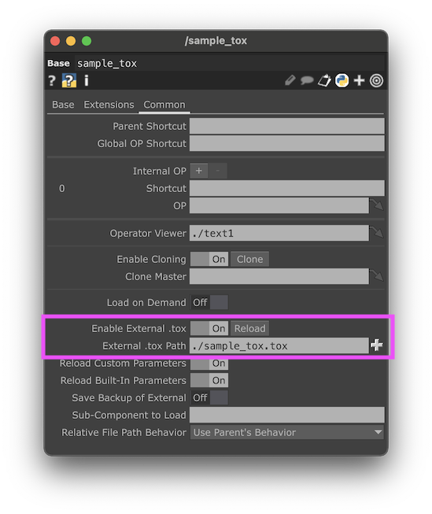
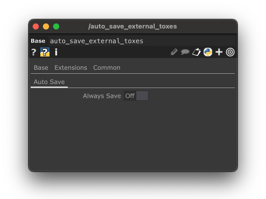

# Auto-save external toxes

A little script that auto-executes every time you save your project (`.toe`) and automatically saves all external toxes.

## Usage

Simply add [auto_save_external_toxes.tox](./auto_save_external_toxes.tox) to your TD project (once, doesn't matter where) and it will start auto-saving.

For an external tox to be auto-saved;

make sure its `enableexternaltox` toggle is enabled and it contains a file path in its `externaltox` field:



### Settings

The auto-save tox contains one setting; `Always Save` which is DISABLED by default. When enabled, exyternal toxes will be auto-saved, regardless if they are dirty or not.



## How it works

the [auto_save_external_toxes.tox](./auto_save_external_toxes.tox) contains only an `Execute` DAT with the following script:

```py
def onProjectPreSave(*_):
 always = parent().par.Alwayssave
 _autosave(always)


def _autosave(always: bool = False):
  for op in _toxes(always=always):
    path = op.par.externaltox.eval()
    debug(f"AUTO-SAVE external tox {op=} {path=}")
    op.save(path)


def _toxes(rootOp = None, always: bool = False):
  parent = rootOp or root

  for child in parent.findChildren(type=COMP):
    if always or child.dirty:
      if child.par.enableexternaltox.eval() and child.par.externaltox.eval():
        yield child
      yield from _toxes(rootOp=child, always=always)
```

So all that happens it that everytime, before the project is saved, it finds all COMP ops in the project (recursively) that meet the following requirements and saves them to the their `externaltox` path:

- Its `enableexternaltox` parameter set to `True`
- Its `externaltox` parameter contains a file location (the tox will be auto-saved to this path)
- Either its `dirty` flag is `True` or the `Alwayssave` custom parameter on the root `Base` COMP of `auto_save_external_toxes.tox` is enabled (disabled by default)
